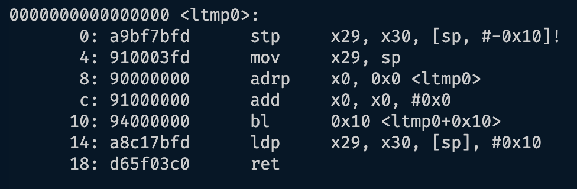
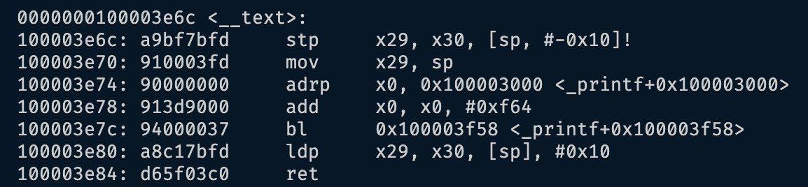
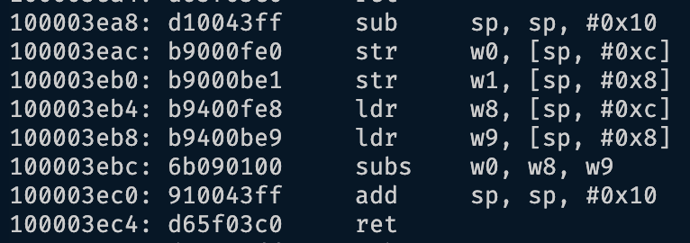

# Malware Analysis
## 1.5 Anatomy of Binary

#### Write a C program that contains several functions and compile it into an assembly file, an object file, and an executable binary, respectively.
* Program: `example.c`
    ``` 
    #include <stdio.h>
    
    void say_hello() {
        printf("Hello, World!\n");
    }
    
    int add_numbers(int a, int b) {
        return a + b;
    }
    
    int sub_numbers(int a, int b) {
        return a - b;
    }
    
    int main() {
        int add_result = add_numbers(10, 3);
        int sub_result = sub_numbers(10, 3);
        say_hello();
        printf("Addition Result: %d\n", add_result);
        printf("Subtraction Result: %d\n", sub_result);
        return 0;
    }
    ```
* Assembly: ```gcc -S example.c -o assembly_example.s```
* Object: ```gcc -c example.c -o object_example.o```
* Executable: ```gcc example.c -o executable_example```


#### Try to locate the functions you wrote in the assembly file and in the disassembled object file and executable. 
* Assembly: ```cat assembly_example.s```
    * `main`
        * 
    * `say_hello`
        * 
    * `add_numbers`
        * 
    * `sub_numbers`
        * 
* Object: ```objdump -d object_example.o```
    * `main`
        * 
    * `say_hello`
        * 
    * `add_numbers`
        * 
    * `sub_numbers`
        * 
* Executable: ```objdump -d executable_example```
    * `main`
        * 
    * `say_hello`
        * 
    * `add_numbers`
        * 
    * `sub_numbers`
        * 

#### Can you see the correspondence between the C code and the assembly code?
* The assembly code and C code were similar in function structure. There was a function name definition, along with the coresponding implementation indented below it, to define the method's functionality. The C program was more easily redable than the assembly program.

#### Finally, strip the executable and try to identify the functions again.
* Executable:
* `strip executable_example`
* `objdump -d executable_example`
    * `main`
        * 
    * `say_hello`
        * 
    * `add_numbers`
        * 
    * `sub_numbers`
        * 
* In the unstripped files, we can map the function names from the orginal C program to the labels in the assembly. After stripping, the correspondence is lost becuase the symbol names are removed. This leaves just memory addresses and machine instruction sets left to understand and trace functionality. 


